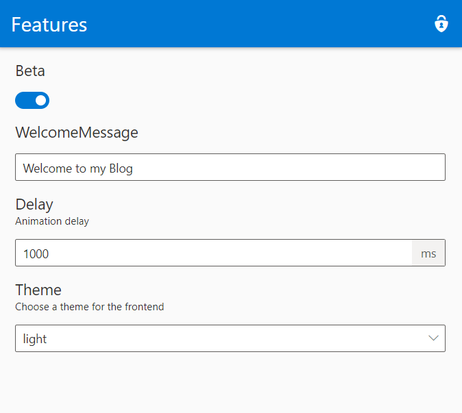
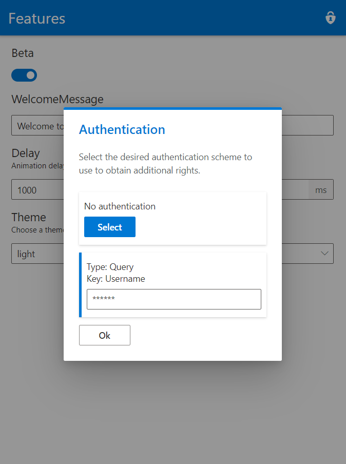

# AspNetCore.FeatureManagement.UI

[](https://www.codefactor.io/repository/github/odonno/aspnetcore.featuremanagement.ui)

| Package | Versions |
| ------- | -------- |
| AspNetCore.FeatureManagement.UI | [](https://www.nuget.org/packages/AspNetCore.FeatureManagement.UI/) |
| AspNetCore.FeatureManagement.UI.InMemory.Storage | [](https://www.nuget.org/packages/AspNetCore.FeatureManagement.UI.InMemory.Storage/) |
| AspNetCore.FeatureManagement.UI.SqlServer.Storage | [](https://www.nuget.org/packages/AspNetCore.FeatureManagement.UI.SqlServer.Storage/) |
| AspNetCore.FeatureManagement.UI.Configuration.GroupFeature | [](https://www.nuget.org/packages/AspNetCore.FeatureManagement.UI.Configuration.GroupFeature/) |
| AspNetCore.FeatureManagement.UI.Configuration.TimeWindowFeature | [](https://www.nuget.org/packages/AspNetCore.FeatureManagement.UI.Configuration.TimeWindowFeature/) |

Perfectly designed UI for Feature Flags in ASP.NET Core Web API

**ASP.NET Core** versions supported: 3.1

This package allows you to configure your application inside your own ASP.NET Core Web API. You can create and configure a large number of feature toggles.

### Summary

* [Purpose](#purpose)
* [Getting started](#getting-started)
* [Configuration](#configuration)
  * [Value types](#value-types)
  * [Storage Providers](#storage-providers)
    * [In memory](#inmemory)
    * [SQL Server](#sql-server)
  * [Feature types](#feature-types)
    * [Server feature](#server-feature)
    * [Client feature](#client-feature)
    * [Group feature](#group-feature)
    * [Time window feature](#time-window-feature)
  * [User Interface](#user-interface)
  * [Authentication](#authentication)
    * [Authorization](#authorization)
    * [UI settings](#ui-settings)
  * [Realtime updates](#realtime-updates)
    * [Feature updated event handlers](#feature-updated-event-handlers)
* [Feature consumption](#feature-consumption)
  * [Self-consumption](#self-consumption)
  * [API](#api)

### Purpose

This library is meant to create, use and provide something developers are calling `Feature Flag` or `Feature Toggle`. It can be viewed as a configuration system. The main benefit over using a simple configuration file like `appsettings.json` is that:

1. You can change any configuration value dynamically
2. You get a simple UI to configure your app

##### Do's and Don'ts

This library has for only purpose to let you create, use and provide Feature Flags inside your ASP.NET Core Web API. It is NOT meant to become a CMS or any storage system (file, SQL or NoSQL). Here are some examples of what you can or cannot do with the library:

* ✅ create features that can be manually deactivated at any time
* ✅ create a light/dark theme feature
* ✅ temporarily store a welcome message
* ❌ store a list of blog articles
* ❌ store chat messages
* ❌ store sensitive data (credentials, connection strings, etc...)

### Getting started

In order to get a working Feature Management system in your API, you first have to add the features that should be used by your API. Don't forget to set a storage provider too.

```cs
public void ConfigureServices(IServiceCollection services)
{
    services.AddFeatures(c =>
    {
        var themes = new List<string>
        {
            "light",
            "dark"
        };

        // Storage provider
        c.AddInMemoryStorage()
            // Beta feature, enabled by default
            .ServerFeature("Beta", true)
            // Welcome message
            .ServerFeature("WelcomeMessage", "Welcome to my Blog")
            // Theme feature, "light" by default
            .ClientFeature("Theme", themes[0], "Choose a theme for the frontend", themes);
    });

    services.AddScoped<IFeaturesAuthService, DefaultFeaturesAuthService>();

    // ...
}

public void Configure(IApplicationBuilder app, IWebHostEnvironment env)
{
    // Apply features configuration
    app.UseFeatures();

    // Enable features UI
    app.UseEndpoints(endpoints =>
    {
        endpoints.MapFeaturesUI();
    });
}
```

You will then be able to display the UI at the following url: `/features-ui`.



### Configuration

##### Value types

`AspNetCore.FeatureManagement.UI` works with the following types of value:

* `boolean`
* `integer`
* `decimal`
* `string`

```csharp
configuration.ServerFeature("Beta", true);
```

By default, it provides a feature without strict limitation. You can however specify a list of choices to limit the number of options available.

```csharp
var themes = new List<string>
{
    "light",
    "dark"
};

configuration.ClientFeature("Theme", themes[0], "Choose a theme for the frontend", themes);
```

##### Storage Providers

`AspNetCore.FeatureManagement.UI` offers several storage providers.

###### InMemory

```cs
services.AddFeatures(c =>
{
    c.AddInMemoryStorage();
});
```

###### Sql Server

```cs
services.AddFeatures(c =>
{
    string connectionString = Configuration.GetConnectionString("DefaultConnection");
    c.AddSqlServerStorage(connectionString);
});
```

##### Feature types

###### Server feature

A server feature is defined globally and it will have the same value for every user of the application.

```csharp
configuration.ServerFeature("Beta", true);
```

Server features are often only managed by an admin.

###### Client feature

A client feature has a different value for each user of the application. Each user will see the default value but they can update it at anytime (default behavior).

```csharp
var themes = new List<string>
{
    "light",
    "dark"
};

configuration.ClientFeature("Theme", themes[0], "Choose a theme for the frontend", themes);
```

###### Group feature

A group feature give you the ability to set a value based on a user affected group. It can be useful when you give certain rights to users like (Azure AD) roles or when you want to gradually roll out features to some groups of users. If one group matches, the value of the gorup is applied.

If no group match, the default value will be applied.

In order to use this type of feature, you need to install the [AspNetCore.FeatureManagement.UI.Configuration.GroupFeature](https://www.nuget.org/packages/AspNetCore.FeatureManagement.UI.Configuration.GroupFeature/) package.

```csharp
configuration
    .ClientFeature(
        "Beta", 
        defaultValue: false, 
        configuration: new GroupFeatureConfiguration<bool>
        {
            Groups = new List<GroupFeature<bool>>
            {
                new GroupFeature<bool> { Group = "Ring1", Value = true },
                new GroupFeature<bool> { Group = "Ring2", Value = true },
                new GroupFeature<bool> { Group = "Ring3", Value = false },
                new GroupFeature<bool> { Group = "Ring4", Value = false }
            }
        }
    );
```

###### Time window feature

A time window feature give you the ability to set a value based on a speicifed date range. It can be useful to apply a different value differs based on the current period of time. Some benefits you can get would be:

* apply feature before or after next month/week/year, to roll out a new feature
* apply feature only during a day/week/month, to experiment a feature or to set a limited time event 

If no time window match, the default value will be applied.

In order to use this type of feature, you need to install the [AspNetCore.FeatureManagement.UI.Configuration.TimeWindow](https://www.nuget.org/packages/AspNetCore.FeatureManagement.UI.Configuration.TimeWindow/) package.

```csharp
configuration
    .ServerFeature(
        "GameSeasons", 
        defaultValue: "Summer", 
        configuration: new TimeWindowFeatureConfiguration<string>
        {
            TimeWindows = new List<TimeWindowFeature<string>>
            {
                new TimeWindowFeature<string> { StartDate = new DateTime(2020, 01, 01), EndDate = new DateTime(2020, 04, 01), Value = "Winter" },
                new TimeWindowFeature<string> { StartDate = new DateTime(2020, 04, 01), EndDate = new DateTime(2020, 07, 01), Value = "Spring" },
                new TimeWindowFeature<string> { StartDate = new DateTime(2020, 07, 01), EndDate = new DateTime(2020, 10, 01), Value = "Summer" },
                new TimeWindowFeature<string> { StartDate = new DateTime(2020, 10, 01), EndDate = new DateTime(2021, 01, 01), Value = "Fall" }
            }
        }
    );
```

##### User Interface

If you like to see the features for yourself. You can enable the UI by configuring it:

```cs
public void Configure(IApplicationBuilder app, IWebHostEnvironment env)
{
    // ...

    app.UseEndpoints(endpoints =>
    {
        endpoints.MapFeaturesUI();
    });
}
```

You will then be able to display the UI at the following url: `/features-ui`.

##### Authentication

You should add an `IFeaturesAuthService` to handle features authentication.

```csharp
services.AddScoped<IFeaturesAuthService, DefaultFeaturesAuthService>();
```

There is a default service you can use named `DefaultFeaturesAuthService`. Here is the how it works:

* Everyone can read all features
* No one can update a *server* feature
* Each user can update a *client* feature
* No way to define a client id (returns `null`)

###### Authorization

There is some authentication schemes you can use to authenticate users and give access to features:

* No authentication (anonymous)
* Query params authentication
* Header authentication

For example, you can apply a JWT Bearer authentication using the `Authorization` HTTP header and define a `IFeaturesAuthService` to use the user information stored inside the JWT token.

###### UI settings

You can configure the UI by providing the authentication schemes used in the application:

```csharp
configuration.AuthSchemes.Add(new NoAuthenticationScheme());
configuration.AuthSchemes.Add(new QueryAuthenticationScheme { Key = "Username" });
```

It will give each user an access to the `Authentication` dialog to select the desired authentication mechanism.



##### Realtime updates

###### Feature updated event handlers

There are event handlers you can use that are triggered when a feature is updated.

```csharp
c.OnServerFeatureUpdated = (IFeature feature) =>
{
    // Do something when a server feature is updated 
};
c.OnClientFeatureUpdated = (IFeature feature, string clientId) =>
{
    // Do something when a client feature is updated 
};
```

### Feature consumption

Once everything is setup, you can now consume the features in two ways:

* self-consumption = inside your Web API
* API = other services through API calls

##### Self-consumption 

Inside your ASP.NET Core Web API, you can inject the `IFeaturesService`.

```cs
public interface IFeaturesService
{
    Task<List<Feature>> GetAll();
    Task<Feature> Get(string featureName);
    Task<T> GetValue<T>(string featureName, string? clientId = null);
    Task<Feature> SetValue<T>(string featureName, T value, string? clientId = null);
}
```

You can get and use all features at once, detect if a feature is valid or not and even update the value of a feature based on your needs.

##### API

Once you map the features UI, you give everyone the ability to call an API the features. As an example, it can be pretty handy if you write a React application and you want to enable/disable some features dynamically.

The API is defined like this:

```
Retrieve all features

GET - /features
```

```
Set feature value

POST - /features/{featureName}/set
Payload: { value: boolean | number | string }
```

```
Retrieve authentication schemes

GET - /features/auth/schemes
```